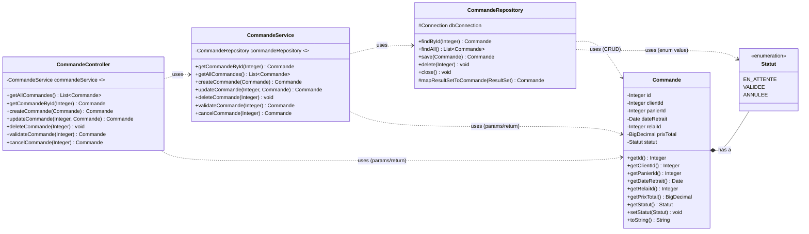

### Diagramme de classe

```mermaid
classDiagram
    direction LR

    class CommandeController {
        -CommandeService commandeService <<Inject>>
        +getAllCommandes() List~Commande~
        +getCommandeById(Integer) Commande
        +createCommande(Commande) Commande
        +updateCommande(Integer, Commande) Commande
        +deleteCommande(Integer) void
        +validateCommande(Integer) Commande
        +cancelCommande(Integer) Commande
    }

    class CommandeService {
        -CommandeRepository commandeRepository <<Inject>>
        +getCommandeById(Integer) Commande
        +getAllCommandes() List~Commande~
        +createCommande(Commande) Commande
        +updateCommande(Integer, Commande) Commande
        +deleteCommande(Integer) void
        +validateCommande(Integer) Commande
        +cancelCommande(Integer) Commande
    }

    class CommandeRepository {
        #Connection dbConnection
        +findById(Integer) Commande
        +findAll() List~Commande~
        +save(Commande) Commande
        +delete(Integer) void
        +close() void
        #mapResultSetToCommande(ResultSet) Commande
    }

    class Commande {
        -Integer id
        -Integer clientId
        -Integer panierId
        -Date dateRetrait
        -Integer relaiId
        -BigDecimal prixTotal
        -Statut statut
        +getId() Integer
        +getClientId() Integer
        +getPanierId() Integer
        +getDateRetrait() Date
        +getRelaiId() Integer
        +getPrixTotal() BigDecimal
        +getStatut() Statut
        +setStatut(Statut) void
        +toString() String
    }

    class Statut {
        <<enumeration>>
        EN_ATTENTE
        VALIDEE
        ANNULEE
    }

    %% --- Relationships ---
    CommandeController ..> CommandeService : uses
    CommandeController ..> Commande : uses (params/return)

    CommandeService ..> CommandeRepository : uses
    CommandeService ..> Commande : uses (params/return)

    CommandeRepository ..> Commande : uses (CRUD)
    CommandeRepository ..> Statut : uses (enum value)

    Commande *-- Statut : has a
    %% CommandeRepository ..> Connection : uses (Impl detail) - Omitted
    %% CommandeRepository ..> ResultSet : uses (Impl detail) - Omitted
```
