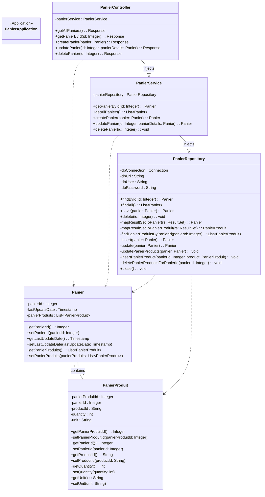

# Diagramme de classe 

```mermaid
classDiagram
    class PanierApplication {
        <<Application>>
    }
    class PanierController {
        -panierService : PanierService
        +getAllPaniers() : Response
        +getPanierById(id: Integer) : Response
        +createPanier(panier: Panier) : Response
        +updatePanier(id: Integer, panierDetails: Panier) : Response
        +deletePanier(id: Integer) : Response
    }
    class Panier {
        -panierId : Integer
        -lastUpdateDate : Timestamp
        -panierProduits : List~PanierProduit~
        +getPanierId() : Integer
        +setPanierId(panierId: Integer)
        +getLastUpdateDate() : Timestamp
        +setLastUpdateDate(lastUpdateDate: Timestamp)
        +getPanierProduits() : List~PanierProduit~
        +setPanierProduits(panierProduits: List~PanierProduit~)
    }
    class PanierProduit {
        -panierProduitId : Integer
        -panierId : Integer
        -productId : String
        -quantity : int
        -unit : String
        +getPanierProduitId() : Integer
        +setPanierProduitId(panierProduitId: Integer)
        +getPanierId() : Integer
        +setPanierId(panierId: Integer)
        +getProductId() : String
        +setProductId(productId: String)
        +getQuantity() : int
        +setQuantity(quantity: int)
        +getUnit() : String
        +setUnit(unit: String)
    }
    class PanierRepository {
        -dbConnection : Connection
        -dbUrl : String
        -dbUser : String
        -dbPassword : String
        +findById(id: Integer) : Panier
        +findAll() : List~Panier~
        +save(panier: Panier) : Panier
        +delete(id: Integer) : void
        -mapResultSetToPanier(rs: ResultSet) : Panier
        -mapResultSetToPanierProduit(rs: ResultSet) : PanierProduit
        -findPanierProduitsByPanierId(panierId: Integer) : List~PanierProduit~
        -insert(panier: Panier) : Panier
        -update(panier: Panier) : Panier
        -updatePanierProducts(panier: Panier) : void
        -insertPanierProduct(panierId: Integer, product: PanierProduit) : void
        -deletePanierProductsForPanierId(panierId: Integer) : void
        +close() : void
    }
    class PanierService {
        -panierRepository : PanierRepository
        +getPanierById(id: Integer) : Panier
        +getAllPaniers() : List~Panier~
        +createPanier(panier: Panier) : Panier
        +updatePanier(id: Integer, panierDetails: Panier) : Panier
        +deletePanier(id: Integer) : void
    }

    PanierController --|> PanierService : injects
    PanierService --|> PanierRepository : injects
    Panier "1" -- "*" PanierProduit : contains
    PanierController ..> Panier
    PanierService ..> Panier
    PanierRepository ..> Panier
    PanierRepository ..> PanierProduit
```