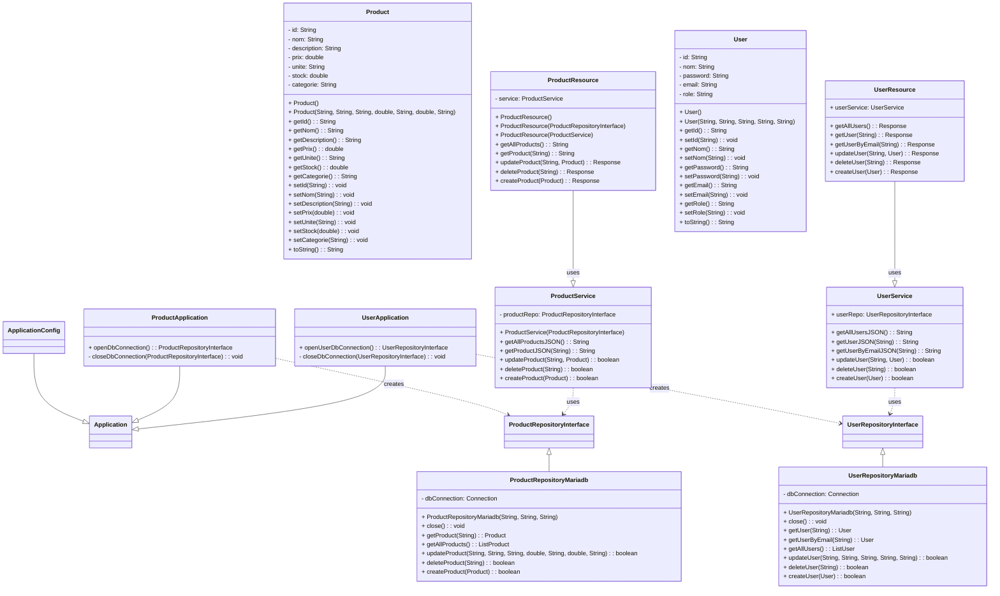

```mermaid
classDiagram
class ApplicationConfig
class Product {
- id: String
- nom: String
- description: String
- prix: double
- unite: String
- stock: double
- categorie: String
+ Product()
+ Product(String, String, String, double, String, double, String)
+ getId(): String
+ getNom(): String
+ getDescription(): String
+ getPrix(): double
+ getUnite(): String
+ getStock(): double
+ getCategorie(): String
+ setId(String): void
+ setNom(String): void
+ setDescription(String): void
+ setPrix(double): void
+ setUnite(String): void
+ setStock(double): void
+ setCategorie(String): void
+ toString(): String
  }
  class ProductApplication {
+ openDbConnection(): ProductRepositoryInterface
- closeDbConnection(ProductRepositoryInterface): void
  }

class ProductRepositoryMariadb {
- dbConnection: Connection
+ ProductRepositoryMariadb(String, String, String)
+ close(): void
+ getProduct(String): Product
+ getAllProducts(): ListProduct
+ updateProduct(String, String, String, double, String, double, String): boolean
+ deleteProduct(String): boolean
+ createProduct(Product): boolean
  }
  class ProductResource {
- service: ProductService
+ ProductResource()
+ ProductResource(ProductRepositoryInterface)
+ ProductResource(ProductService)
+ getAllProducts(): String
+ getProduct(String): String
+ updateProduct(String, Product): Response
+ deleteProduct(String): Response
+ createProduct(Product): Response
  }
  class ProductService {
- productRepo: ProductRepositoryInterface
+ ProductService(ProductRepositoryInterface)
+ getAllProductsJSON(): String
+ getProductJSON(String): String
+ updateProduct(String, Product): boolean
+ deleteProduct(String): boolean
+ createProduct(Product): boolean
  }

class User {
- id: String
- nom: String
- password: String
- email: String
- role: String
+ User()
+ User(String, String, String, String, String)
+ getId(): String
+ setId(String): void
+ getNom(): String
+ setNom(String): void
+ getPassword(): String
+ setPassword(String): void
+ getEmail(): String
+ setEmail(String): void
+ getRole(): String
+ setRole(String): void
+ toString(): String
  }
  class UserApplication {
+ openUserDbConnection(): UserRepositoryInterface
- closeDbConnection(UserRepositoryInterface): void
  }

class UserRepositoryMariadb {
- dbConnection: Connection
+ UserRepositoryMariadb(String, String, String)
+ close(): void
+ getUser(String): User
+ getUserByEmail(String): User
+ getAllUsers(): ListUser
+ updateUser(String, String, String, String, String): boolean
+ deleteUser(String): boolean
+ createUser(User): boolean
  }
  class UserResource {
+ userService: UserService
+ getAllUsers(): Response
+ getUser(String): Response
+ getUserByEmail(String): Response
+ updateUser(String, User): Response
+ deleteUser(String): Response
+ createUser(User): Response
  }
  class UserService {
+ userRepo: UserRepositoryInterface
+ getAllUsersJSON(): String
+ getUserJSON(String): String
+ getUserByEmailJSON(String): String
+ updateUser(String, User): boolean
+ deleteUser(String): boolean
+ createUser(User): boolean
  }
  ApplicationConfig --|> Application
  ProductApplication --|> Application
  ProductApplication ..> ProductRepositoryInterface : creates
  ProductRepositoryInterface <|-- ProductRepositoryMariadb
  ProductResource --|> ProductService : uses
  ProductService ..> ProductRepositoryInterface : uses
  UserApplication --|> Application
  UserApplication ..> UserRepositoryInterface : creates
  UserRepositoryInterface <|-- UserRepositoryMariadb
  UserResource --|> UserService : uses
  UserService ..> UserRepositoryInterface : uses
```